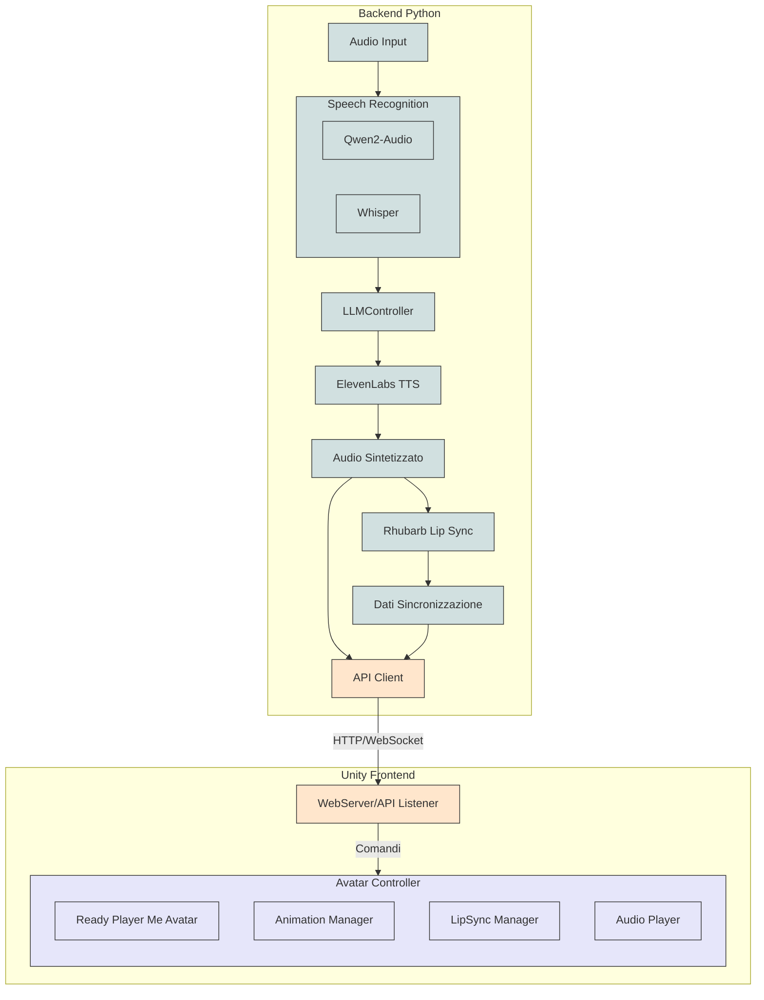

# Assistente Personale con Avatar 3D Animato

Questo progetto implementa un assistente personale con avatar 3D animato che risponde alle richieste vocali degli utenti. Il sistema elabora l'input audio dell'utente, genera una risposta testuale, la converte in voce sintetizzata, e anima un avatar 3D con sincronizzazione labiale accurata per creare un'esperienza interattiva coinvolgente.

## Panoramica dell'Architettura

Il sistema utilizza un'architettura client-server dove il backend Python gestisce l'elaborazione dell'audio e del testo, mentre il frontend Unity si occupa della visualizzazione e animazione dell'avatar 3D.

### Pipeline di Elaborazione


```
Audio input → [Qwen2-Audio/Whisper] → Testo trascritto → [LLMController] → Risposta → [ElevenLabs] → Audio sintetizzato
                                                                                           ↓
                                                                         [Rhubarb Lip Sync] → Dati sincronizzazione labiale
                                                                                           ↓
                                                                         [Ready Player Me] → Avatar 3D animato
```


### Backend (Python)
- Gestisce la registrazione e l'elaborazione dell'input audio
- Utilizza Qwen2-Audio o Whisper per la trascrizione audio-testo
- Genera risposte tramite un LLMController (che può utilizzare Qwen2-Audio o altri modelli)
- Converte il testo in audio con ElevenLabs
- Genera dati di sincronizzazione labiale con Rhubarb Lip Sync
- Comunica con il frontend Unity tramite API HTTP o WebSocket

### Frontend (Unity)
- Espone API (HTTP o WebSocket) per ricevere comandi dal backend
- Visualizza e anima l'avatar 3D di Ready Player Me
- Applica la sincronizzazione labiale in tempo reale
- Gestisce la riproduzione audio sincronizzata con l'animazione

```
Backend Python                       Unity Frontend
│                                    │
├── Input Audio                      ├── WebServer/API Listener
│   ├── Qwen2-Audio                  │   ├── /avatar/lipsync
│   └── Whisper                      │   ├── /avatar/animate
├── LLMController                    │   └── /avatar/playAudio
│   └── Generazione risposta         │
├── ElevenLabs                       ├── AvatarController
│   └── Audio sintetizzato           │   ├── Ready Player Me Avatar
├── Rhubarb LipSync                  │   ├── AnimationManager
│   └── Dati sincronizzazione        │   └── LipSyncManager
└── API Client                       │
    └── Invio comandi a Unity        │
```




## Requisiti di Sistema

- Python 3.8 o superiore
- FFmpeg
- Rhubarb Lip Sync
- Unity 2022.3 o superiore (per lo sviluppo; non necessario per l'utilizzo dell'applicazione finale)
- Git LFS (per gestire i file binari del progetto Unity)
- Almeno 16GB di RAM (consigliati)
- GPU con almeno 8GB di VRAM (consigliata) per prestazioni ottimali

## Configurazione dell'Ambiente

### 1. Preparazione dell'Ambiente

#### Clonazione del repository con submodule

```bash
# Clona il repository principale con tutti i submodule
git clone --recursive https://github.com/your-username/avatar-3d-assistente.git
cd avatar-3d-assistente

# Se hai già clonato senza --recursive:
git submodule init
git submodule update
```

#### Installazione di Git LFS

```bash
# Per macOS
brew install git-lfs

# Per Ubuntu/Debian
sudo apt install git-lfs

# Per Windows
# Scarica e installa da https://git-lfs.github.com/

# Inizializzazione in ogni repository che lo utilizza
git lfs install
```

#### Configurazione Unity YAML Merger

```bash
# Per configurazione globale
git config --global merge.unityyamlmerge.name "Unity YAML Merger"
git config --global merge.unityyamlmerge.driver "/Applications/Unity/Hub/Editor/[versione Unity]/Unity.app/Contents/Tools/UnityYAMLMerge merge -p %O %B %A %A"

# Sostituisci [versione Unity] con la versione effettiva installata
# Su Windows, il percorso sarà diverso, tipicamente:
# "C:/Program Files/Unity/Hub/Editor/[versione Unity]/Editor/Data/Tools/UnityYAMLMerge.exe"
```

#### Creazione dell'ambiente virtuale Python

```bash
# Per Linux/macOS
python3 -m venv venv
source venv/bin/activate

# Per Windows
python -m venv venv
venv\Scripts\activate
```

#### Aggiornamento di pip e installazione delle dipendenze

```bash
pip install --upgrade pip
pip install -r requirements.txt
```

### 2. Installazione delle Dipendenze di Sistema

#### Installazione di FFmpeg

**Per macOS:**
```bash
brew install ffmpeg
```

**Per Ubuntu/Debian:**
```bash
sudo apt update
sudo apt install ffmpeg
```

**Per Windows:**
1. Scarica FFmpeg da [https://ffmpeg.org/download.html](https://ffmpeg.org/download.html)
2. Estrai i file in una directory (es. `C:\ffmpeg`)
3. Aggiungi la directory `bin` al PATH di sistema

#### Installazione di Rhubarb Lip Sync

1. Scarica l'ultima versione di Rhubarb Lip Sync dal [repository ufficiale](https://github.com/DanielSWolf/rhubarb-lip-sync/releases)
2. Crea una directory `bin` nel tuo progetto
3. Estrai il contenuto del file ZIP scaricato nella directory `bin`
4. Rendi l'eseguibile `rhubarb` eseguibile (su Linux/macOS):
   ```bash
   chmod +x bin/rhubarb
   ```

### 3. Configurazione delle API

#### 3.1 Configurazione di Qwen2-Audio

Per utilizzare Qwen2-Audio, è necessario installare le dipendenze specifiche:

```bash
pip install git+https://github.com/huggingface/transformers
```

#### 3.2 Configurazione di ElevenLabs

1. Registrati su [ElevenLabs](https://elevenlabs.io/) per ottenere un'API key
2. Crea una voce o seleziona una voce esistente e annota il voice ID

### 4. Configurazione del Progetto

#### Creazione del file .env

Crea un file `.env` nella directory principale del progetto con il seguente contenuto:

```
# Credenziali ElevenLabs
ELEVEN_LABS_API_KEY=your_api_key_here
ELVEN_LABS_VOICE_ID=your_voice_id_here
ELEVEN_LABS_MODEL_ID=eleven_monolingual_v1

# Configurazioni Rhubarb
RHUBARB_PATH=./bin/rhubarb

# Percorso output
OUTPUT_DIR=./output
```

## Testare i Componenti

Organizza i test dei componenti in una struttura di directory come questa:

```
component_test/
├── elevenlabs/
│   ├── test_output/
│   ├── voice_list.py
│   └── test_eleven_labs.py
├── rhubarb/
│   ├── test_output/
│   ├── test_rhubarb.py
│   └── test_rhubarb_with_phonetic.py
└── qwen/
    ├── test_output/
    └── test_qwen.py
```

### Test di ElevenLabs

#### Ottenere la lista delle voci disponibili

```bash
python component_test/elevenlabs/voice_list.py
```

#### Testare la sintesi vocale

```bash
python component_test/elevenlabs/test_eleven_labs.py
```

### Test di Rhubarb Lip Sync

#### Test con il riconoscitore Phonetic (per lingue non inglesi)

```bash
python component_test/rhubarb/test_rhubarb_with_phonetic.py test_output/test_italian_complex.mp3 --output test_output/output_phon.json
```

#### Test con il riconoscitore PocketSphinx (per lingua inglese)

```bash
python component_test/rhubarb/test_rhubarb.py test_output/test_italian_complex.mp3 --output test_output/output_pock.json
```

### Test di Audio-to-Text
Per registrare un audio
```bash
python component_test/qwen/record_mic.py --output test_output/user_input.mp3
```

Per sottoporre l'audio registrato a Qwen2-Audio
```bash
python component_test/qwen/test_qwen.py -a test_output/user_input.mp3 -p "Qual è il contenuto di questo audio?" -o test_output/qwen_anser.txt
```

Per sottoporre l'audio registrato a Qwen2-Audio (versione semplificata)
```bash
python component_test/qwen/test_qwen_simple.py -a test_output/user_input.mp3 -p "Qual è il contenuto di questo audio?" -o test_output/qwen_anser.txt
```

Per sottoporre l'audio registrato a Whisper
```bash
python component_test/whisper/test_whisper.py -a test_output/user_input.mp3 -o test_output/trascrizione.txt
```

## Gestione del Repository

Il progetto utilizza una struttura con submodule Git per gestire separatamente il codice del backend Python e il progetto Unity. Di seguito le raccomandazioni per gestire correttamente il repository:

### Lavorare con il Submodule Unity

#### Clonazione del repository
```bash
# Clona con submodule
git clone --recursive https://github.com/your-username/avatar-3d-assistente.git

# Se hai clonato senza --recursive
git submodule init
git submodule update
```

#### Aggiornare il Submodule Unity
```bash
# Entrare nel submodule
cd Unity3DAvatar

# Fare modifiche e commit come in un normale repository
git add .
git commit -m "Descrizione delle modifiche all'avatar"
git push

# Tornare al repository principale e aggiornare il riferimento al submodule
cd ..
git add Unity3DAvatar
git commit -m "Aggiornato submodule Unity con nuove animazioni"
git push
```

#### Ottenere gli ultimi aggiornamenti
```bash
# Nel repository principale
git pull
git submodule update --remote

# Oppure per aggiornare e fare merge in un solo comando
git submodule update --remote --merge
```

### Lavorare con Git LFS

LFS gestisce automaticamente i file binari del progetto Unity in base alle configurazioni nel file `.gitattributes`. Quando si lavora con file tracciati da LFS:

```bash
# Visualizzare i file tracciati da LFS
git lfs ls-files

# Forzare il download dei file LFS dopo un pull
git lfs pull

# In caso di problemi con file LFS
git lfs fetch --all
git lfs pull --include="*" --exclude=""
```

### Risoluzione di Conflitti nei File Unity

Per i conflitti nei file YAML di Unity, il merger configurato aiuterà automaticamente. In caso di conflitti complessi:

1. Usa lo Unity Scene Merger configurato:
   ```bash
   git checkout --theirs path/to/conflicted/file.unity
   git add path/to/conflicted/file.unity
   ```

2. In alternativa, risolvi manualmente aprendo il progetto in Unity e ricostruendo le modifiche conflittuali.

3. Per conflitti irrisolvibili, considera di utilizzare Prefab nidificati in Unity per modularizzare il lavoro e ridurre i conflitti.

## Risoluzione dei Problemi

### Problemi con ElevenLabs
- Verifica che la tua API key e Voice ID siano corretti nel file .env
- Assicurati di avere credito sufficiente sul tuo account ElevenLabs
- Controlla la connessione internet

### Problemi con Rhubarb Lip Sync
- Verifica che il percorso all'eseguibile sia corretto in .env
- Assicurati che l'eseguibile abbia i permessi di esecuzione
- Controlla che il formato audio sia supportato da Rhubarb

### Problemi con Qwen2-Audio
- Assicurati di avere abbastanza RAM e spazio GPU per il modello
- Verifica che il file audio sia in un formato supportato
- Per problemi di memoria, prova a usare versioni più piccole del modello

### Problemi con Unity e Git
- Assicurati che Git LFS sia installato e inizializzato
- Verifica che i file binari siano correttamente tracciati da LFS
- Per problemi con il submodule, prova a reinizializzarlo:
  ```bash
  git submodule deinit -f Unity3DAvatar
  git submodule update --init Unity3DAvatar
  ```
